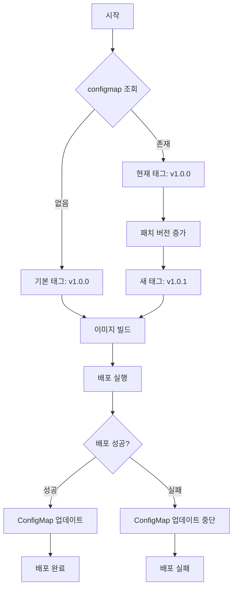

# scripts 디렉토리 문서화

## 📋 개요

`scripts` 디렉토리는 FastAPI 애플리케이션의 배포와 관리를 위한 스크립트들이 위치한 디렉토리입니다. 
각 스크립트는 자동화된 배포 프로세스의 단계별 역할을 수행합니다.

## 📁 스크립트 목록

### 1. 설치 및 준비

1. `1.start_cluster.sh`
   - Colima + k3s 클러스터 시작
   - 자동 설치 기능 포함
   - containerd 런타임 사용
   - Kubernetes 네임스페이스 자동 생성

2. `2.prepare_terraform.sh`
   - Terraform 설치 및 환경 설정
   - 환경 변수 자동화
   - Terraform 초기화 (terraform init)
   - Terraform 검증 (terraform validate)

### 2. 배포 프로세스

1. `3.build_app.sh`
   - FastAPI 애플리케이션 빌드
   - Docker 이미지 생성
   - 테스트 실행

2. `4.deploy_all.sh`
   - 전체 배포 자동화
   - ConfigMap 업데이트
   - Pod 상태 모니터링

### 3. 클러스터 관리

1. `6.delete_cluster.sh`
   - Colima 클러스터 중지 및 삭제
   - 모든 리소스 정리
   - 환경 정리

### 3. Terraform 관리

5. `4.prepare_terraform.sh`
   - Terraform 자동 설치   
     - 버전: 1.2.6
     - 설치 경로: $HOME/.local/bin/terraform
   - 환경 변수 설정
     - STAGE
     - namespace
     - CSV_PATH
     - LOG_LEVEL
     - image_tag
     - n_hours
   - Terraform 초기화 및 검증

6. `5.deploy_terraform.sh`
   - Terraform 배포 실행
   - 변경사항 확인
   - 리소스 생성/수정
   - 롤백 처리

## 📊 실행 순서

```bash
# 1. 클러스터 시작 (필수)
./1.start_cluster.sh

### 결과
- Colima 클러스터 시작
- Kubernetes 설정
- nerdctl alias 설치
- 클러스터 상태 확인

# 2. Terraform 환경 준비 (필수)
./2.prepare_terraform.sh

### 결과
- Terraform 자동 설치 (버전 1.2.6)
- 환경 변수 설정
- Terraform 초기화 완료

# 3. 애플리케이션 빌드
./3.build_app.sh

### 결과
- Docker 이미지 빌드
- 이미지 태그 생성
- 테스트 실행

# 4. 전체 배포
./4.deploy_all.sh

### 결과
- AWS 키 자동 추출
- Terraform 배포 (5.deploy_terraform.sh 포함)
- ConfigMap 업데이트
- Pod 상태 모니터링

# 5. Terraform 배포 (선택)
./5.deploy_terraform.sh

### 결과
- AWS 키 자동 추출
- Terraform 배포 실행
- 변경사항 확인
- 리소스 생성/수정

# 6. 클러스터 종료
./6.delete_cluster.sh

### 결과
- Colima 클러스터 정지
- 모든 리소스 정리
- 환경 초기화
```

### 주의사항
- 1, 2번 스크립트는 반드시 실행해야 합니다.
- 클러스터와 Terraform 환경이 준비되어야만 나머지 스크립트가 정상 작동합니다.

## 🛠 이미지 태그 관리 플로우

### 1. 태그 생성 규칙
- 버전 형식: `vX.Y.Z` (예: v1.0.0)
- 스테이지 포함: `{stage}-vX.Y.Z` (예: dev-v1.0.0)

### 2. 태그 증가 규칙
1. `configmap/iamkeycheck-config`에서 현재 태그 조회
2. 패치 버전(Patch) 자동 증가
3. 예시:
   ```
   v1.0.0 → v1.0.1 → v1.0.2 → ...
   ```

### 3. 이미지 빌드 및 관리
1. 이미지명 형식: `iamkeycheck:{stage}-vX.Y.Z`
2. 동일 태그 이미지 존재 시 덮어쓰기
3. imagePullPolicy: Never 설정 시 클러스터 내부 사용

### 4. ConfigMap을 통한 태그 관리
1. 태그 저장 위치: `configmap/iamkeycheck-config`
2. 배포 후 자동 업데이트
3. 관리 방식:
   - 배포 성공 시 ConfigMap 업데이트
   - 배포 실패 시 ConfigMap 업데이트 중단

## 🔄 배포 플로우



## 🛠 실행 옵션

### 1. 자동 승인 옵션

```bash
# 자동 승인 모드 (프롬프트 없이 실행)
./3.deploy_all.sh -y

# 프롬프트 모드 (수동 승인 필요)
./3.deploy_all.sh --prompt
```

### 2. Terraform 설치 (자동)

```bash
# 4.prepare_terraform.sh 실행 시 자동 설치
# 버전: 1.2.6
# 설치 경로: $HOME/.local/bin/terraform
```

### 2. 환경 변수

```dotenv
# .env 파일에서 설정
STAGE=dev    # dev / prod
CSV_PATH=app/api/secrets/  # AWS 키 CSV 파일 경로
LOG_LEVEL=INFO  # 로그 레벨
```

## 🚧 주의사항

1. **스크립트 실행 순서**
   - 반드시 순서대로 실행해야 함
   - 중간 단계 건너뛰지 않기
   - stage 변경시 반드시 prepare_terraform.sh를 다시 실행해야 함
   - 반드시 root 디렉토리에서 실행해야 함 (/iamkeycheck에 위치해야 함)

   ```bash
   # 1. 클러스터 시작
   ./1.start_cluster.sh

   # 2. Terraform 환경 준비 (stage 변경시 반드시 실행해야 terraform init이 실행되어 배포가능한 상태가 됨)
   ./2.prepare_terraform.sh

   # 3. 애플리케이션 빌드
   ./3.build_app.sh

   # 4. 전체 배포
   ./4.deploy_all.sh

   # 5. 클러스터 종료
   ./5.delete_cluster.sh
   ```

2. **권한 확인**
   - 실행 권한이 있는지 확인
   ```bash
   chmod +x *.sh
   ```

3. **의존성**
   - Colima
   - nerdctl
   - Terraform

4. **환경 변수**
   - `.env` 파일 필수
   - AWS 키 CSV 필수
